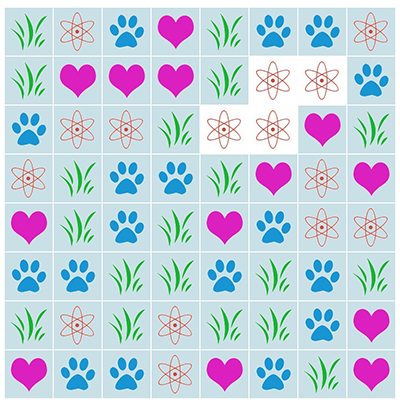

# Cells Task - JS11

* Есть прямоугольное игровое поле, состоящее из ячеек.
* Ячейки располагаются в произвольном порядке.
* В каждой ячейке может находится одна картинка.
* При наведении мышки на любую из ячеек мы должны подсвечивать элемент и соседние по горизонтали и вертикали такие же элементы.
* Организуйте свой код так, чтобы он работал для поля любых размеров.
* Используйте ES6;
* Картинки для ячеек можно найти в [папке](./images/background) 

